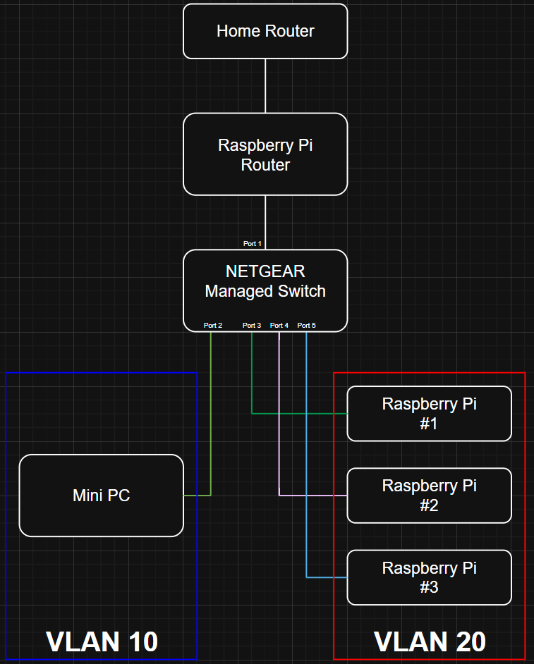

# Router-on-a-Stick Multi-VLAN Network Using a Raspberry Pi Layer-3 Gateway

This will explain how to build a router-on-a-stick network using a Raspberry Pi as a Layer-3 gateway. The goal is to create two isolated VLANs with independent DHCP scopes, routed through a single trunk port on a managed switch. This setup simulates a small enterprise network and provides a platform for testing segmentation, routing, and network scanning techniques.

In this lab, I will be using the following:
- 4 x Raspberry Pis
- 4 x SD card (2GB or more each)
- 1 x Mini PC
- 1 x Netgear managed switch


## Hardware Setup
- Install RaspAP on an SD card using Raspberry Pi Imager and install SD card into Pi.
- Install Raspberry Pi OS Lite on another SD card the same way and install it onto another Raspberry Pi. Do the same to the rest of the Pis.
- Make sure the Raspberry Pi you're using as a router has 2 ethernet ports. If not, use a usb/ethernet dongle to add another port.
- Connect the home router and switch to the Pi and turn the Pi on.
- Connect the rest of the Raspberry Pis and the mini PC to the switch and turn the rest of the devices on. 
- Scan the network using nmap to identify the Router Pi's IP address.
- Access the web interface by typing the Router Pi's IP address into web browser.
- Login with username "admin" password "secret".
- Change login and username to something more secure.
- Disable hotspot, since it's not being used.

## Switch VLAN Configuration
- Go to the managed switch web interface.
- Change the password to something more secure.
- Go to VLAN > 802.1Q > Advanced and enable Advanced 802.1Q VLAN.
- Go to VLAN Configuration and create 2 vlans with the vlan ids of 10 and 20.
- Go to VLAN Membership and assign the following to each port for each vlan (x is unassigned):
```
VLAN 10: T U x x x
VLAN 20: T x U U U
```
- Go to Port PVID and assign each port with the following PVID:
```
Port 1: 1
Port 2: 10
Port 3: 20
Port 4: 20
Port 5: 20
```
- Go back to VLAN Membership and change vlan 1 to "U x x x x".

## Raspberry Pi VLAN Interface Configuration
- Ssh into the Router Pi.
- Install vlan using "sudo apt install vlan" and run the following commands:
```
sudo modprobe 8021q
echo "8021q" | sudo tee -a /etc/modules
```
- Create vlan interfaces by running the following commands:
```
sudo ip link add link eth0 name eth0.10 type vlan id 10
sudo ip link add link eth0 name eth0.20 type vlan id 20

sudo ip addr add 192.168.10.1/24 dev eth0.10
sudo ip addr add 192.168.20.1/24 dev eth0.20

sudo ip link set eth0.10 up
sudo ip link set eth0.20 up
```
- Create the parent interface definition by creating the file "/etc/systemd/network/10-eth0.network" and add:
```
[Match]
Name=eth0

[Network]
VLAN=eth0.10
VLAN=eth0.20
```
- Create vlan 10 interface by creating the file "/etc/systemd/network/20-vlan10.netdev" and add:
```
[NetDev]
Name=eth0.10
Kind=vlan

[VLAN]
Id=10
```
- Create file "/etc/systemd/network/21-vlan10.network" and add:
```
[Match]
Name=eth0.10

[Network]
Address=10.0.10.1/24
```
- Create vlan 20 interface by creating the file "/etc/systemd/network/30-vlan20.netdev" and add:
```
[NetDev]
Name=eth0.20
Kind=vlan

[VLAN]
Id=20
```
- Create file "/etc/systemd/network/31-vlan20.network" and add:
```
[Match]
Name=eth0.20

[Network]
Address=10.0.20.1/24
```
- Restart networking by running "sudo systemctl restart systemd-networkd".
- Run "ip a | grep eth0". You should see eth0.10 with 10.0.10.1/24 and eth0.20 with 10.0.20.1/24.

## DHCP & NAT Setup
- Configure dhcp by editing "/etc/dnsmasq.conf" and add:
```
# VLAN 10
interface=eth0.10
dhcp-range=10.0.10.50,10.0.10.150,24h

# VLAN 20
interface=eth0.20
dhcp-range=10.0.20.50,10.0.20.150,24h

# Upstream DNS
server=8.8.8.8
server=8.8.4.4
```
- Restart dnsmasq by running "sudo systemctl restart dnsmasq".
- Run the following commands:
```
sudo iptables -t nat -A POSTROUTING -o eth1 -j MASQUERADE
sudo netfilter-persistent save
```

# Validation & Testing
- Reset the Pis and do a network scan with the ip range 10.0.10.0/24 and 10.0.20.0/24 from the mini pc. You should see all the Pis, vlan gateways and the switch.
- Ping google.com to verify you have internet connection.
- Remove the ethernet providing internet access from the Pi router and run an nmap scan again on the mini pc to verify that nothing changed.

